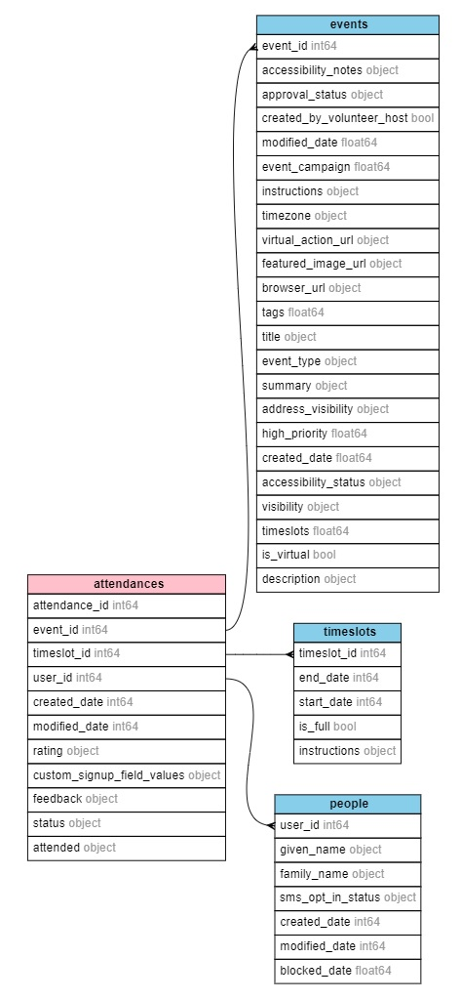

## Overview

The goal of this project is to transform a file from the Mobilize America API describing attendance at recent Working Families events for analysis.

## Data Strategy

The requirements for this project were to turn the Mobilize America file, a nested JSON, into a series of flat CSV files, including one file each to describe the events, timeslots, and people data in the original JSON file.

I chose to normalize the data into four tables using a basic [star schema approach](https://en.wikipedia.org/wiki/Star_schema):

- One fact table (`attendances`) that maintains the relationship of all of the related foreign keys in the dimension tables. This table's unique primary key is `attendance_id`.
- Three dimention tables (`events`, `timeslots`, and `people`) with unique primary keys `event_id`, `timeslot_id`, and `user_id`, respectively.

## Project Strategy

The overall plan to transform the data was:

1. Flatten the JSON file into one large parent DataFrame.
2. Drop all rows that have nulls in any of the primary key columns (`attendance_id`, `event_id`, `timeslot_id`, and `user_id`).
3. Ensure that the datatypes are correct.
4. Create the four child DataFrames (`attendances`, `events`, `timeslots`, and `people`), transform them, and export them to CSV.
5. Generate a diagram to illustrate the fields, datatypes, and relationships between the four exported CSV files.

The project was implemented in two files:

1. `process_data.py`: Contains steps 1-4 above.
2. `generate_diagram.py`: Contains step 5.

The step-by-step transformations for each file are described in the inline comments and docstrings in both files. Because the transformation steps for the three dimension tables were identical, these were refactored into a single transformation function - `create_child_dataframe()` - to make the code more readable and to prevent repetition/ensure DRY code. The transformations for the `attendances` DataFrame were too dissimilar to implement in the same function, so those were left as a series of scripted transformations.

I chose to use the `pandas` library to perform the data transformation in this project because it's a large, flexible module that I knew would have all of the functionality needed to complete the assignment. The largest limiting factor is size of the dataset: if the JSON was so large it couldn't be processed in memory on my local machine, I would have used a local Spark cluster via `pyspark` for its ability to write data to disk during large transformations. 

The code was formatted with [Black](https://github.com/psf/black) for consistency.

## Instructions to Data Analyst

Follow these instructions to prepare the JSON dataset for analysis:

1. Clone this repository.
2. [Create and activate a Python virtual environment.](https://www.geeksforgeeks.org/create-virtual-environment-using-venv-python/)
3. [Import the project's package dependencies via the `requirements.txt` file.](https://note.nkmk.me/en/python-pip-install-requirements/) Note: there are numerous unnecessary/optional packages included here that would be removed if this project were prepared for public distribution or production purposes.
4. Run `process_data.py` to transform and export the child tables to the `data` folder.
5. (Optional) Run `generate_diagram.py` to create a schema output file that can be translated into a relational diagram on [a site like this one.](https://edotor.net/)

These are the three research questions these datasets need to answer:

### 1. How many people RSVP’d to an event with a given ID?
### 2. What event had the most number of completed attendances?
### 3. What timeslot for a given event had the most event attendances?

All of these questions can be answered by querying the `attendances` table. As described above, this table uses the `attendance_id` field as a primary key and maintains the `event_id`, `timeslot_id`, and `user_id` fields as foreign keys to match back to their respective dimension tables. The answer to question #1 will return an integer count, while questions #2 and #3 will return values for `event_id` and `timeslot_id`, respectively, that can be matched back to their respective tables to access the descriptive fields for those ideas, i.e. the name and description of a given event, and the start and end date of a timeslot.